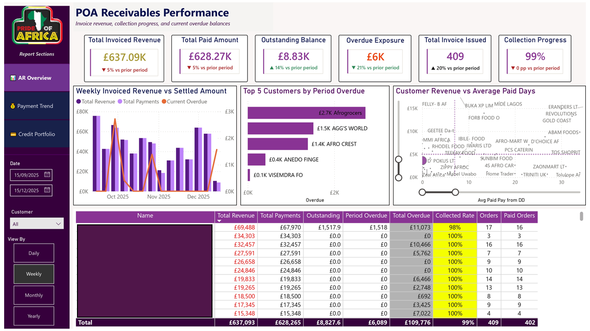

# 📊 Retail Finance Performance Dashboard

A Power BI finance analytics project developed from real operational invoice, settlement and credit data using Power Query, DAX and semantic modelling.

The report converts finance data into a structured reporting model for receivables performance, credit exposure and customer payment behaviour, with interactive analysis from headline KPIs to the customers driving each result.

## Dashboard Preview

## 🎯 Project Objective

The objective was to create a finance reporting model that could support both management-level monitoring and customer-level investigation from the same reporting environment.

The report was designed around five practical questions:

| Reporting question | Why it matters |
| --- | --- |
| How much has been invoiced and collected? | Tracks revenue performance and cash collection |
| What remains outstanding or overdue? | Shows current receivables exposure |
| How is customer credit being used? | Identifies utilisation and concentration risk |
| How quickly are customers paying? | Separates healthy payment behaviour from persistent delay |
| Which customers are driving KPI movements? | Allows finance users to investigate the source of portfolio changes |

## ⚙️ Data Preparation & Model

Power Query was used to clean, validate and structure the reporting data before analysis.

| Area | Implementation |
| --- | --- |
| Data cleansing | Removed voided and non-reportable records and standardised reporting fields |
| Data validation | Checked status, balance, payment and date fields before KPI calculation |
| Payment logic | Derived settlement and payment-delay fields from due-date and payment information |
| Date model | Created a dedicated date structure for daily, weekly, monthly and yearly analysis |
| Credit data | Integrated customer credit information with invoice activity for exposure and utilisation analysis |
| AR snapshot | Kept current overdue data separate where snapshot reporting required different logic from invoice history |

The model deliberately separates transaction history from current-state AR information where the two datasets represent different reporting contexts.

## 🧮 DAX & Reporting Logic

The report uses a reusable DAX measure layer rather than calculations tied to individual visuals.

Measures were developed for:

1. Invoiced revenue and settled value
2. Outstanding and overdue exposure
3. Collection performance
4. Credit utilisation
5. Paid invoice counts and values
6. Average and median paid days
7. Late-payment rate and value
8. Prior-period movement
9. Customer contribution and portfolio share

### Filter Context

One of the main modelling challenges was the current overdue snapshot.

The AR snapshot represents a current-state position rather than historical invoice activity, so it remains disconnected from the transaction model.

`TREATAS` is used to apply the active customer context to the snapshot when current overdue exposure is required.

This keeps the reporting grain of the snapshot intact while allowing customer selections to remain meaningful across the report.

### Context-Sensitive Measures

Measures were designed to preserve report selections correctly rather than overwrite the user's analytical context.

For example, late-payment measures retain a selected payment-timing category so that choosing a specific delay bucket returns the value and customers associated with that bucket rather than recalculating across all late-payment categories.

This allows users to move from a portfolio KPI into the customer and invoice population responsible for the result.

## 📊 Power BI Report Design

The report uses Power BI functionality to support analysis rather than static presentation.

| Feature | How it was used |
| --- | --- |
| Field parameters | Switch reporting grain between daily, weekly, monthly and yearly views |
| Synced slicers | Maintain consistent date, customer and reporting selections |
| Cross-visual filtering | Trace payment categories and KPI movements into customer drivers |
| Dynamic measures | Recalculate metrics and comparisons under the active filter context |
| Tooltips | Surface supporting invoice counts without adding unnecessary visual clutter |
| Tabular Editor | Organise measures and display folders for easier model maintenance |

## 📈 Reporting Views

The dashboard separates finance analysis into three connected areas.

### Receivables Performance

Tracks invoiced revenue, collections, outstanding balances and overdue exposure, then connects portfolio movements with the customers contributing to them.

### Credit Portfolio

Combines customer credit limits with outstanding and overdue exposure to review utilisation, concentration and account-level credit position.

### Payment Behaviour

Analyses paid-invoice value, payment speed, lateness and timing distribution, then identifies the customers contributing to delayed settlement.

The reporting flow is designed to move from:

**Performance → Exposure → Behaviour → Customer Driver**

rather than treating each visual as an independent chart.

## 🧠 Analytical Decisions

Several measures were deliberately kept separate because similar-looking metrics can answer very different finance questions.

### Current Overdue vs Historical Performance

Current overdue represents the latest AR position.

Historical invoice analysis represents transactions associated with the selected reporting period.

Treating the current snapshot as a historical measure would create misleading comparisons, so the two concepts are modelled separately.

### Average vs Median Paid Days

Average paid days provides an overall measure of payment speed.

Median paid days adds context by showing whether a smaller number of heavily delayed invoices are distorting the average.

Using both measures gives a more reliable view of customer payment behaviour than relying on the mean alone.

### Paid Value vs Late-Paid Value

Paid value represents settled commercial activity.

Late-paid value isolates the financial value associated specifically with delayed settlement.

Keeping the measures separate prevents high-value customers from automatically being interpreted as high-risk customers.

## 🔍 Data Validation & Debugging

Report development included validating measure behaviour against individual customer and invoice populations rather than relying only on portfolio totals.

Unexpected results were investigated through:

1. Customer-level reconciliation
2. Invoice-level checks
3. Filter-context testing
4. Visual interaction testing
5. Comparison of average and median behaviour
6. Review of current-state and historical reporting logic

This was particularly important where the same business metric could produce different results depending on payment status, reporting period or visual selection.

## 🤖 AI-Assisted Development

AI tools were used selectively during development to review DAX logic, investigate unexpected filter behaviour and challenge metric definitions.

Suggestions were treated as development support rather than a source of truth. Measure behaviour was validated against the underlying finance data and expected Power BI filter context before being retained.

AI is not part of the production reporting pipeline.

## 🛠️ Tools and Skills Demonstrated

| Tool or skill | How it was used |
| --- | --- |
| Power BI | Semantic modelling, dashboard development and interactive finance analysis |
| Power Query / M | Data cleansing, validation, transformation and derived reporting fields |
| DAX | Reusable measures, time intelligence and filter-context logic |
| Tabular Editor | Measure organisation and semantic-model maintenance |
| Data modelling | Combined transaction, date, credit and current-state reporting structures |
| Finance analytics | Analysed collections, receivables, credit exposure and payment behaviour |
| Data validation | Reconciled KPI logic and investigated reporting anomalies |
| Business intelligence | Connected management KPIs with customer-level drivers |
| AI-assisted analysis | Supported debugging and logic review with manual validation |

## 📁 Repository Files

| File | Description |
| --- | --- |
| `README.md` | Project methodology, Power BI logic and analytical decisions |
| `Dashboard_Preview.png` | Anonymised preview of the Power BI finance dashboard |

## ✅ What This Project Demonstrates

This project demonstrates my ability to:

1. Translate finance reporting requirements into a structured Power BI model
2. Clean and validate operational data before KPI calculation
3. Develop reusable DAX measures for finance and customer analysis
4. Handle transaction history and current-state data within the same reporting solution
5. Manage filter context across connected and disconnected reporting data
6. Build interactive analysis from KPI level to customer drivers
7. Investigate reporting anomalies through customer and invoice-level validation
8. Structure a semantic model for continued development and maintenance
9. Apply finance logic to receivables, credit and payment behaviour
10. Communicate technical reporting logic in business terms

## 🔐 Public Repository Notes

This project was developed from real operational finance data.

The public repository contains an anonymised dashboard preview only. Customer-identifying information has been removed and no underlying operational dataset is included.
